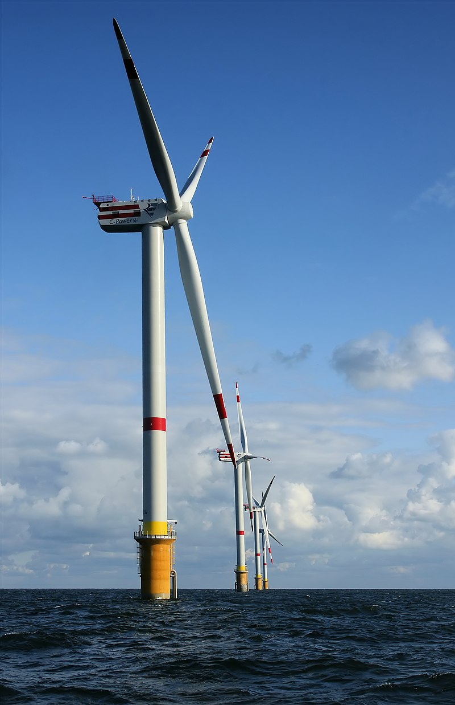

[CONTENTS](./README.md):
- [The project](./README.md#eolos2bios)
- [People](./README.md#People)
- [A short presentation video](./README.md#Presentation)
- [Contacts and information](./README.md#Contacts)

# eolos2bios

--- DETAILED PROJECT DESCRIPTION WILL GO HERE ---

**eolos2bios** is a project developed by Alessandra Berta, Astra Bertelli, Anna Fenoglio and Francesco Tosini and is aimed to tackle the _Sustainability Challenge_ in BRAINstorm | Torino 2025 by providing a solution to the landscape problems given by large wind turbines

  

# People
--- PRESENTATION OF THE PEOPLE THAT MADE THE PROJECT WILL GO HERE ---

Lorem ipsum dolor sit amet, consectetur adipiscing elit. Ut pretium finibus interdum. Aliquam maximus odio eget erat commodo pulvinar. Cras quis ex est. Nullam id tortor sed neque tristique ultricies. Aenean nec diam at diam aliquam commodo. Sed rutrum pretium porttitor. Vestibulum non porta purus. Aenean consectetur lacus sed odio imperdiet, ut congue ligula venenatis. Suspendisse vulputate fringilla lectus interdum volutpat. Proin et dolor efficitur, aliquam magna eu, suscipit ante.

# Presentation
--- PRESENTATION VIDEO WILL GO HERE ---

Fusce suscipit porta lacus vel interdum. Maecenas ornare ultrices sodales. In hac habitasse platea dictumst. Morbi laoreet varius tellus, id ullamcorper lectus pharetra eu. Donec ac libero euismod, efficitur neque eu, efficitur risus. Proin quis sapien eget velit volutpat rhoncus. Vivamus interdum, lorem a rutrum interdum, diam nibh molestie felis, ultrices luctus diam libero et magna. Nullam vitae dolor ipsum. Proin ultrices luctus tellus sed ultricies. Integer tristique nulla nec enim volutpat, ac dignissim tellus imperdiet. Suspendisse faucibus tincidunt lacus, et ornare erat ullamcorper ut.

# Contacts
--- CONTACTS WILL GO HERE ---

Nunc quis nulla iaculis, sollicitudin justo non, gravida urna. Suspendisse potenti. Etiam lacinia eget lacus eget tincidunt. Curabitur vel interdum est. Integer facilisis elementum arcu, in pulvinar tellus commodo eu. Vivamus semper vel metus at egestas. Nullam congue nunc a nunc faucibus ultrices sit amet quis nibh. Mauris pulvinar felis orci, et mollis risus bibendum tempus. Pellentesque sodales eu eros at sollicitudin. Sed a lectus suscipit, rhoncus metus eget, aliquet mi. Nam sed tellus mi. Fusce fringilla ligula lectus, in sollicitudin urna porttitor ac. Nam laoreet nisi id dolor dignissim sagittis. Suspendisse vel porta purus, nec vulputate nisi. Aliquam varius dui a leo elementum, ac varius libero ultrices.
